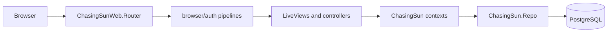

# Architecture

ChasingSun is a Phoenix 1.7 application named `:chasing_sun`. The app uses Phoenix LiveView for most authenticated screens, Ecto/PostgreSQL for persistence, Oban for jobs, Tailwind and esbuild for assets, and Swoosh for mail delivery.

## Request Flow

The web layer lives under `lib/chasing_sun_web/`. It handles routing, authentication plugs and LiveView `on_mount` checks, form events, controllers, components, and presentation. Business operations live under `lib/chasing_sun/` as contexts and supporting modules. Contexts call `ChasingSun.Repo` and Ecto schemas.

## Directory Map

`lib/chasing_sun/`

- `accounts.ex` and `accounts/`: users, session tokens, role permissions, guest restrictions, and email notification helpers.
- `analytics.ex` and `analytics/`: dashboard delegation, forecasts, projections, performance reports, and SpreadsheetML export generation.
- `harvesting.ex` and `harvesting/`: weekly harvest records and audit-backed harvest writes.
- `operations.ex` and `operations/`: ventures, greenhouses, crop cycles, crop rules, farm visits, recommendations, notifications, audits, and crop status calculation.
- `importing.ex` and `importing/`: legacy JSON import entrypoints.
- `workers/`: Oban workers, currently `LegacyImportWorker`.
- `openai.ex`: pickup-note extraction client. TODO: `api_key/0` is currently commented out and should be completed before the feature can call OpenAI.

`lib/chasing_sun_web/`

- `router.ex`: public, authenticated, operations, admin, dev, and auth routes.
- `user_auth.ex`: session plugs and LiveView authorization hooks.
- `live/`: operational LiveViews for dashboard, greenhouses, harvest records, farm visits, recommendations, performance, forecast, and admin screens.
- `controllers/`: home page, auth controllers, settings, confirmations, password reset, and performance export.
- `components/`: shared UI components, layouts, summary cards, status badges, and formatting helpers.

## Tech Stack

- `phoenix`, `phoenix_live_view`, `bandit`: web server, routing, controller, and LiveView runtime.
- `ecto_sql`, `phoenix_ecto`, `postgrex`: database access and migrations.
- `bcrypt_elixir`: password hashing.
- `oban`: background jobs and pruning.
- `swoosh`, `finch`: local mail and HTTP client support.
- `req`, `jason`: OpenAI HTTP requests and JSON handling.
- `tailwind`, `esbuild`, `heroicons`: asset pipeline and UI icons.
- `phoenix_live_dashboard`, `telemetry_metrics`, `telemetry_poller`: development/runtime observability.
- `credo`: dev/test static analysis.

## LiveView Usage

Authenticated product screens are LiveViews. The router groups them into named `live_session`s:

- `:authenticated` mounts `ChasingSunWeb.UserAuth` with `:ensure_authenticated` for `/dashboard`.
- `:operations` mounts with `:ensure_operations_access` for operations screens.
- `:admin` mounts with `:ensure_admin` for admin screens.

`ChasingSun.Operations.RecommendationServer` refreshes daily recommendations and broadcasts on the `operations:updates` topic after refreshes.
