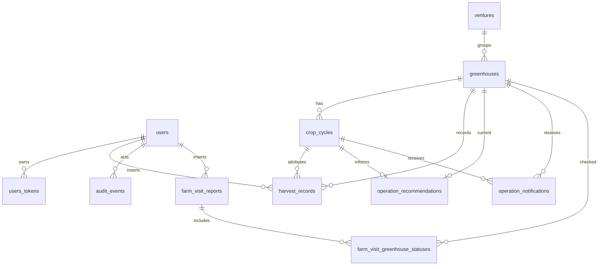

# Data Model

The database is PostgreSQL via `ChasingSun.Repo`.

## Core Tables

### users

Email/password accounts with a unique email. Fields include `hashed_password`, `confirmed_at`, `role`, and guest restriction arrays.

### users_tokens

Auth tokens keyed by `user_id`, `context`, and `token`. Tokens are deleted with the user.

### ventures

Business grouping for greenhouses. `code` is unique.

### greenhouses

Production units. `sequence_no` and `name` are unique. Each greenhouse belongs to a venture and has many crop cycles, harvest records, farm visit statuses, recommendations, and notifications.

### crop_rules

Planning defaults per crop type. Stores dates/durations, varieties, expected yields for 1000/2000 plant units, flat expected yield, forced size, price, and active flag. `crop_type` is unique.

### crop_cycles

Crop lifecycle records per greenhouse: crop type, variety, plant count, nursery/transplant/harvest/soil recovery dates, status cache, and archival timestamp.

### harvest_records

Weekly actual yield rows. A migration intentionally changed the uniqueness rule so multiple rows can exist for the same greenhouse and week, for example separate grades or prices. Current fields include `price_per_kg` and `grade`.

### operation_recommendations

One current recommendation per greenhouse. Stores current crop, next crop/variety, recommendation kind, note, planned dates, and generation date.

### operation_notifications

Operational alerts tied to greenhouse and crop cycle. Unique by `greenhouse_id`, `crop_cycle_id`, and `kind`.

### farm_visit_reports

One report per `visited_on` date. Captures visitor, reserve tank levels, water compliance, overall status, remarks, sign-off, and inserted user.

### farm_visit_greenhouse_statuses

Per-greenhouse rows inside a farm visit. Unique by report and greenhouse where a greenhouse id is present.

### audit_events

Append-only audit rows for actions on entities. Stores actor, entity type/id, action, metadata, and inserted timestamp.

### oban_jobs

Created by Oban migration version 12. Used by imports and Oban internals.
